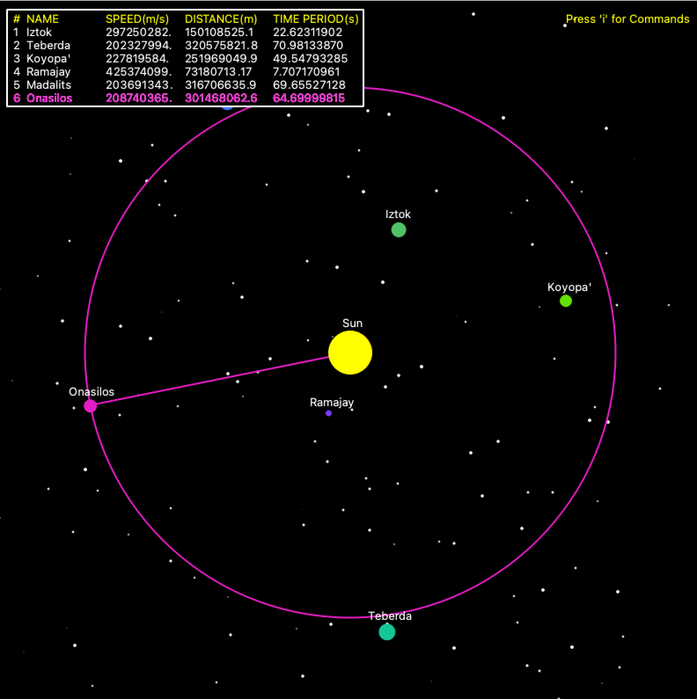

# Solar-System

A 2 dimensional representation of the solar system with trajectory mapping features

## Screenshots

  
## Acknowledgements

 - Dartmouth Computer Science Department - Contributions to cs1lib

  
## License

[MIT](https://choosealicense.com/licenses/mit/)

  
